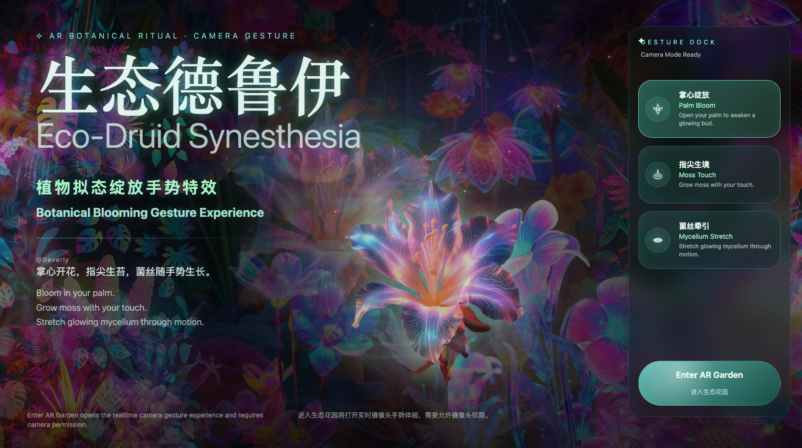

# 🌿 Eco-Druid Synesthesia

生态德鲁伊：植物拟态与绽放 AR 手势特效

<p align="center">
  
</p>

<p align="center">
  <strong>Awaken a flower in your palm. Seed moss with your fingertip. Stretch a living spore web between your hands.</strong>
</p>

<p align="center">
  <strong>用手掌唤醒花朵，用指尖种下苔藓，用双手拉开一张会呼吸的孢子网。</strong>
</p>

<p align="center">
  
  
  
  
</p>

---

## ✨ Overview / 项目概览

Eco-Druid Synesthesia is an original WebXR / AR gesture interaction experiment that transforms hand movement into a living botanical system. Instead of using cold sci-fi interfaces or traditional neon HUD effects, this project explores a softer interaction language: bioluminescent flowers, fingertip moss, water ripples, growing vines, and spore networks.

生态德鲁伊：植物拟态与绽放 是一个原创 AR 手势交互特效作品。项目将用户的手势转化为一套会生长、会呼吸、会回应触碰的生态系统：掌心花开、指尖苔痕、双手孢子网。它不是普通滤镜，也不是科技感 HUD，而是一次偏向自然、治愈、柔光、有机生命感的 AR 交互实验。

---

## 🧬 Concept / 创意核心

| Interaction | 中文设定 | English Concept | Visual Output |
| --- | --- | --- | --- |
| Palm Bloom | 掌心绽放 | Open your palm to awaken a glowing bud. | A translucent flower blooms above the palm. |
| Moss Touch | 指尖苔痕 | Touch the air to seed moss and ripples. | Moss instances and a water-ripple shader grow from the fingertip. |
| Spore Web | 菌丝拉伸 | Pull both hands apart to weave a living spore web. | Lavender spores flow through organic Bezier mycelium curves. |

---

## 🎬 Demo Preview / 效果预览

| Mode | Preview |
| --- | --- |
| Landing Page | `./docs/landing-preview.png` |
| Desktop Preview | Run `npm run dev`, then open `http://localhost:5174/` |
| AR Mode | Requires a WebXR AR compatible device and browser camera permission |

---

## 📦 Official Clean Package / 官方纯净安装包下载

最新版压缩包：[biolume-ar-gesture-v1.0.0.zip](https://github.com/Beverly621/biolume-ar-gesture/releases/download/v1.0.0/biolume-ar-gesture-v1.0.0.zip)

所有历史版本：[前往 Releases 页面](https://github.com/Beverly621/biolume-ar-gesture/releases)


---

## 🌌 Visual Direction / 视觉方向

The visual system is inspired by bioluminescent plants, moonlit forests, translucent petals, organic spores, moss textures, and soft water ripples.

视觉风格重点：

* 非科技 HUD
* 非赛博朋克
* 非普通滤镜叠加
* 强调自然、有机、柔光、呼吸感
* 强调“手势唤醒生态”的仪式感
* 强调原创交互叙事，而不只是视觉装饰

### Color Palette / 色彩规范

| Token | Color | Hex |
| --- | --- | --- |
| Deep Forest | 深林底色 | `#071411` |
| Forest Mist | 雾感深绿 | `#0D241E` |
| Cyan Glow | 荧光青绿 | `#7EF6E7` |
| Moss Green | 苔藓柔绿 | `#A8F5C8` |
| Pollen Gold | 花粉暖黄 | `#F8D879` |
| Lavender Aura | 薰衣草光晕 | `#A78BFA` |
| Text Primary | 柔雾白 | `#EAFBF4` |

---

## 🖐️ Gesture System / 手势系统

### 01. Palm Bloom / 掌心绽放

**Trigger**  
The user opens their palm toward the camera or AR scene.

**Effect**  
A small glowing seed appears above the palm, rises slightly, and blooms into a translucent flower. Pollen particles expand outward and slowly fade into the air.

**Design Notes**  
The flower should feel alive, soft, and slightly wet. The effect avoids hard sci-fi energy beams or aggressive neon edges.

### 02. Moss Touch / 指尖苔痕

**Trigger**  
The user pinches or touches a virtual point with the fingertip.

**Effect**  
A moss instance activates at the contact point while a custom GLSL ripple expands with normal-map distortion.

**Design Notes**  
This interaction should feel like planting life into space. The feedback should be quiet, tactile, and organic.

### 03. Spore Web / 菌丝拉伸

**Trigger**  
The user brings both hands into view and pulls them farther than 15 cm apart.

**Effect**  
Five organic Bezier curves form between the palms while lavender particles flow along each curve.

**Design Notes**  
The network should not look like a digital grid. It should look like glowing mycelium, soft vine fibers, and floating pollen.

---

## 🛠️ Tech Stack / 技术栈

| Layer | Technology |
| --- | --- |
| Frontend | HTML / CSS / JavaScript / Vite |
| 3D Rendering | Three.js |
| AR / XR | WebXR, Three.js `ARButton` |
| Hand Input | WebXR Hand Input joints, camera permission preflight via `getUserMedia` |
| Animation | `requestAnimationFrame`, Three.js render loop, CSS keyframes |
| Shader Effects | GLSL / `ShaderMaterial` / water ripple normal map |
| Particles | `THREE.Points`, pooled particle systems |
| Instancing | `THREE.InstancedMesh` for moss tufts |
| Assets | `public/assets/eco_druid_assets` |
| Deployment | GitHub over SSH on port `443` |

---

## 🚀 Getting Started / 快速启动

### 1. Clone the repository / 克隆项目

```bash
GIT_SSH_COMMAND="ssh -p 443" git clone git@github.com:Beverly621/biolume-ar-gesture.git
cd biolume-ar-gesture
```

### 2. Install dependencies / 安装依赖

```bash
npm install
```

### 3. Prepare assets and environment / 初始化素材与环境

```bash
npm run setup
```

### 4. Run locally / 本地运行

```bash
npm run dev
```

or:

```bash
npm start
```

Open:

```text
http://localhost:5174/
```

Stop the local server:

```text
Ctrl + C
```

---

## 🏷️ Release Build / 自动打包发布

GitHub Actions workflow:

```text
.github/workflows/release-build.yml
```

Create and push a version tag to publish a clean source package:

```bash
git tag v1.0.0
GIT_SSH_COMMAND="ssh -p 443" git push origin v1.0.0
```

The workflow can also be triggered manually from GitHub Actions:

```text
Actions → Auto Build Release Zip → Run workflow
```

---

## 🌐 Browser & AR Support / 浏览器与 AR 支持

| Environment | Status | Notes |
| --- | --- | --- |
| Desktop Chrome | Preview Mode | Supports desktop visual preview. |
| Mobile Chrome Android | AR Mode | WebXR AR support depends on device and browser version. |
| iOS Safari | Limited | WebXR AR support may be limited. Desktop preview is recommended. |
| Localhost | Recommended | Camera permission is more stable on localhost. |

If AR mode is not supported, the project will automatically fall back to Preview Mode.

如果当前浏览器不支持 WebXR AR，页面会自动进入桌面演示模式，仍可查看手势特效和视觉交互。

---

## 🎨 UI Direction / 页面设计方向

The landing page is designed as a ritual-like AR entrance rather than a technical control panel.

页面入口不应像后台调试页，而应像一个“生态仪式入口”。

| Component | Purpose |
| --- | --- |
| AmbientBackground | Deep forest gradient, mist, floating spores, sleeping seed |
| HeroCopy | Bilingual project title and concept description |
| ImmersiveViewport | Reference-image landing layer with a revealable WebXR / Three.js VFX layer |
| GestureDock | Lightweight glass gesture selector with active glow rail |
| StatusBadge | AR support status and preview mode hint |
| FooterHint | Browser and camera permission guidance |

---

## 🧩 Core Effects / 核心特效模块

### Palm Bloom

* WebXR palm anchoring
* Procedural flower proxy
* Bloom scale animation
* Pollen particle burst
* Soft additive material

### Moss Touch

* Fingertip / pinch detection
* Instanced moss growth
* Ripple shader
* Normal-map distortion
* Soft cyan and moss-green glow

### Spore Web

* Two-hand distance detection
* Dynamic Bezier curve generation
* Organic noise deformation
* Lavender spore particles on curves
* Soft glowing line material

---

## 📌 Originality Statement / 原创说明

This project is an original AR gesture interaction concept created around the theme of Eco-Druid Synesthesia.

The core originality lies in:

1. Combining hand gestures with botanical growth metaphors.
2. Turning AR interaction into a soft ecological ritual.
3. Replacing cold sci-fi HUD language with organic material feedback.
4. Designing three connected gesture effects as one coherent living system:
   * Palm Bloom
   * Moss Touch
   * Spore Web

本项目围绕「生态德鲁伊：植物拟态与绽放」进行原创设计，核心创意不是简单叠加植物贴图，而是将手势识别、植物生长、孢子网络、水纹反馈组合为一套连续的生态交互语言。

---

## 🧠 Design Differentiation / 差异化说明

Many gesture-based AR effects focus on energy beams, futuristic light trails, cyberpunk UI, or simple decorative overlays. This project intentionally avoids those common directions.

Instead, it focuses on:

* Material softness
* Organic growth
* Biological rhythm
* Healing interaction
* Tactile visual feedback
* A poetic relationship between hand movement and virtual life

常见 AR 手势特效容易落入“赛博光束、未来科技线条、HUD 面板、静态滤镜叠加”的风格。本项目主动规避这些方向，强调自然生命感、低刺激柔光、触觉反馈和空间中的生态生长。

---

## 📸 Screenshots / 项目截图

| Landing Page |
| --- |
|  |

---

## ⚙️ Development Notes / 开发说明

Recommended implementation order:

1. Build the landing page and bilingual UI.
2. Implement desktop preview mode.
3. Add WebXR hand input and gesture state detection.
4. Implement Palm Bloom.
5. Implement Moss Touch.
6. Implement Spore Web.
7. Add WebXR AR session support.
8. Optimize performance and fallback mode.
9. Add final screenshots and demo GIFs.

Performance guidelines:

* Keep particle count adaptive for mobile devices.
* Use compressed textures when possible.
* Avoid too many transparent overlapping meshes.
* Use instancing for repeated leaves, spores, or small particles.
* Provide preview mode when AR is unavailable.

---

## 🙏 Credits / 致谢

Created by Beverly Kim.

Original concept: Eco-Druid Synesthesia / 生态德鲁伊：植物拟态与绽放

Special thanks to open-source WebXR, Three.js, and hand-tracking communities.
